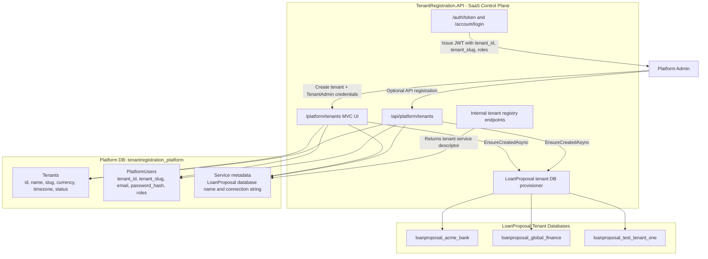
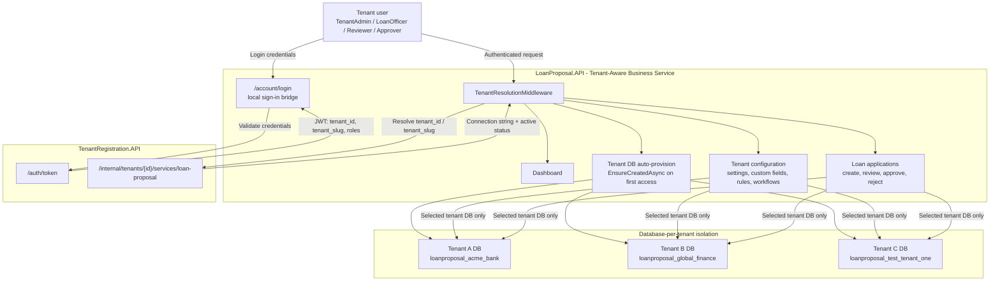
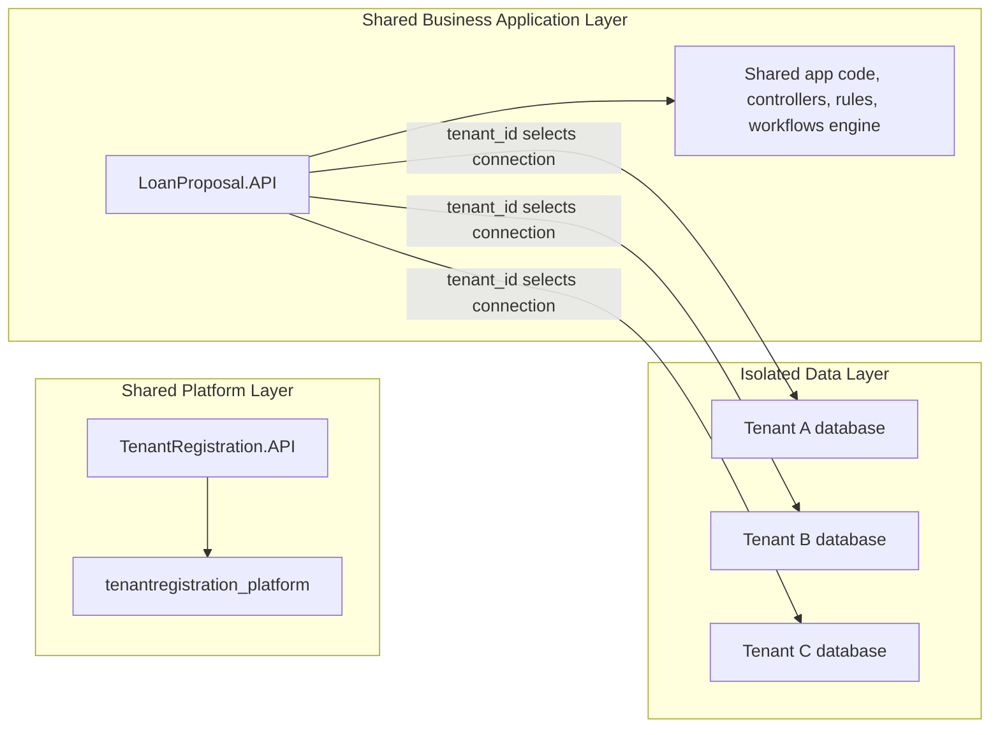

# SaaS Multitenancy Architecture

This blueprint uses a split-service SaaS model:

- TenantRegistration.API is the platform control plane.
- LoanProposal.API is the tenant-aware business data plane.
- Tenant identity is centralized in the platform database.
- Business data is isolated by physical database per tenant.

## 1. Tenant Registration / Control Plane

### Control Plane Responsibilities

- Registers tenants.
- Creates the first `TenantAdmin` user during tenant creation.
- Stores tenant identity and service metadata.
- Issues JWTs containing tenant and role claims.
- Exposes internal registry endpoints so business services can resolve the correct tenant database.
- Provisions the LoanProposal tenant database when a new tenant is registered.

## 2. LoanProposal Business API / Data Plane

### Business Plane Responsibilities

- Delegates authentication to TenantRegistration.
- Reads tenant claims from JWT or local cookie.
- Resolves tenant database metadata from TenantRegistration.
- Enforces role-based access.
- Opens only the resolved tenant database for workspace configuration and loan proposal workflows.
- Auto-creates the tenant database on first access if metadata exists but the physical database is missing.

## SaaS Multitenancy Modality

This is a **shared application, database-per-tenant** SaaS model:

- Application instances are shared across tenants.
- Tenant identity and login are centralized.
- Business data is isolated in separate physical databases.
- The tenant registry maps each tenant to its business service database.
- Tenant claims and role claims decide which tenant and features a user can access.
